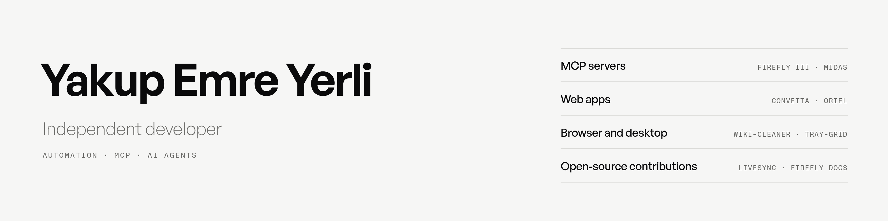

<picture>
  <source media="(prefers-color-scheme: dark)" srcset="assets/banner-dark.png">
  
</picture>

Independent developer from Türkiye. I build websites for small businesses, automation and bots, MCP servers that connect AI agents to real services, and desktop tools for Linux.

## Selected work

- **[mcp-firefly-iii](https://github.com/YakupEmreYerli/mcp-firefly-iii)**: security-first, self-hosted MCP server for Firefly III. 152 operations behind 5 scoped tools, stdio and authenticated HTTP. Listed in the official Firefly III docs.
- **[mcp-midas](https://github.com/YakupEmreYerli/mcp-midas)**: unofficial MCP server for Midas Atlas. Reads portfolio, transaction history and technicals; order tools are off by default and every order needs desktop approval.
- **[Convetta](https://github.com/YakupEmreYerli/Convetta)**: free online image converter and resizer at [convetta.com](https://www.convetta.com). JPG, PNG and WEBP conversion never leaves the browser. SvelteKit, Docker.
- **[oriel](https://github.com/YakupEmreYerli/oriel)**: notes and docs on your own server, with nested pages, a block editor and databases in table and board views.
- **[tray-grid](https://github.com/YakupEmreYerli/tray-grid)**: Windows-style hidden tray icon grid for KDE Plasma 6.
- **[Wiki-Cleaner](https://github.com/YakupEmreYerli/Wiki-Cleaner)**: Firefox extension that turns Wikipedia's internal links into plain text and hides citation markers.

## Open-source contributions

- **[vrtmrz/obsidian-livesync](https://github.com/vrtmrz/obsidian-livesync)**: fix and regression tests for a startup scan that could delete records from CouchDB in the CLI daemon ([#1188](https://github.com/vrtmrz/obsidian-livesync/pull/1188)). Adapted and released in 1.0.29 ([#1191](https://github.com/vrtmrz/obsidian-livesync/pull/1191), [#1192](https://github.com/vrtmrz/obsidian-livesync/pull/1192)).
- **[saidsurucu/borsa-mcp](https://github.com/saidsurucu/borsa-mcp)**: adapted the Mynet stock list parser to the site's new layout; while it was broken, KAP news lookups quietly came back empty ([#18](https://github.com/saidsurucu/borsa-mcp/pull/18)).
- **[firefly-iii/docs](https://github.com/firefly-iii/docs)**: added the Firefly III MCP server to the official third-party apps list ([#259](https://github.com/firefly-iii/docs/pull/259), [#260](https://github.com/firefly-iii/docs/pull/260)).

## Activity

<picture>
  <source media="(prefers-color-scheme: dark)" srcset="activity/dark.svg">
  
</picture>

## Türkçe

Türkiye'den bağımsız geliştiriciyim. Küçük işletmeler için web siteleri, otomasyon ve botlar, yapay zekâ ajanlarını gerçek servislere bağlayan MCP sunucuları ve Linux için masaüstü araçları yazıyorum.

[yakupemreyerli.com](https://yakupemreyerli.com) · [LinkedIn](https://www.linkedin.com/in/yakupemreyerli/)
